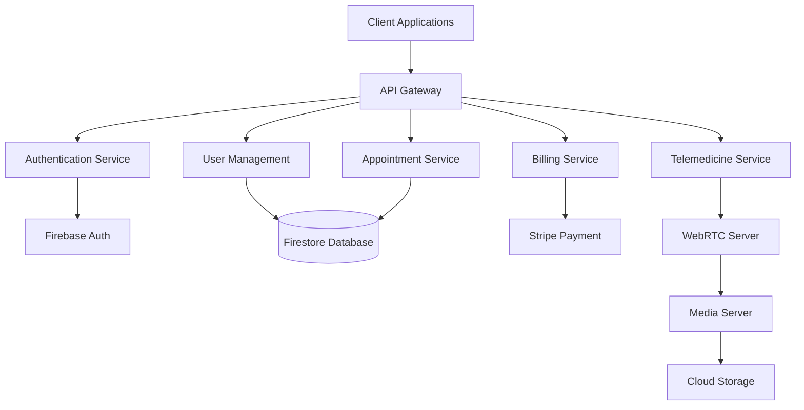
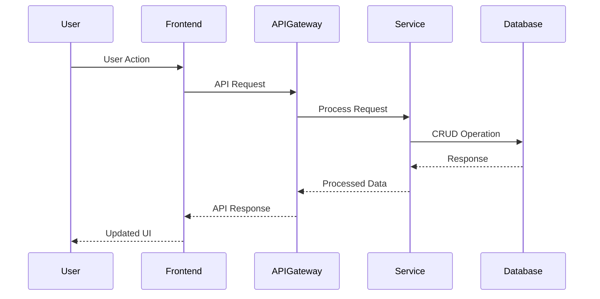
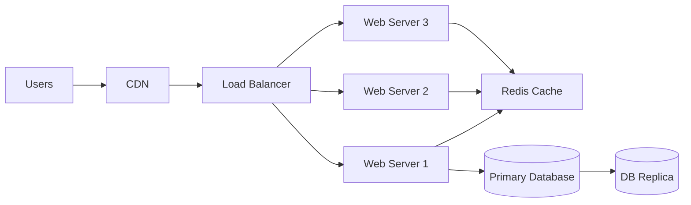
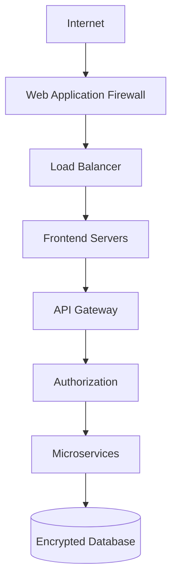
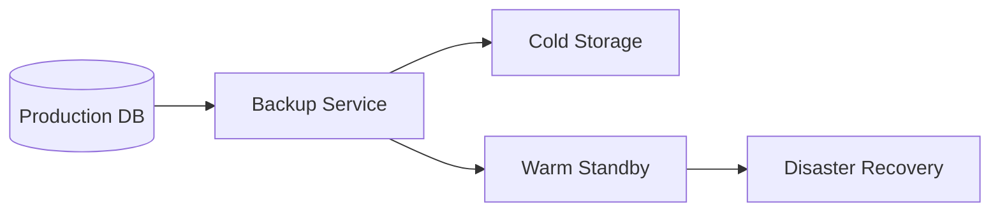
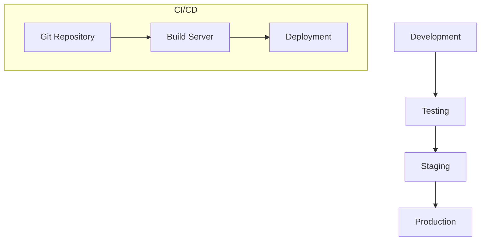
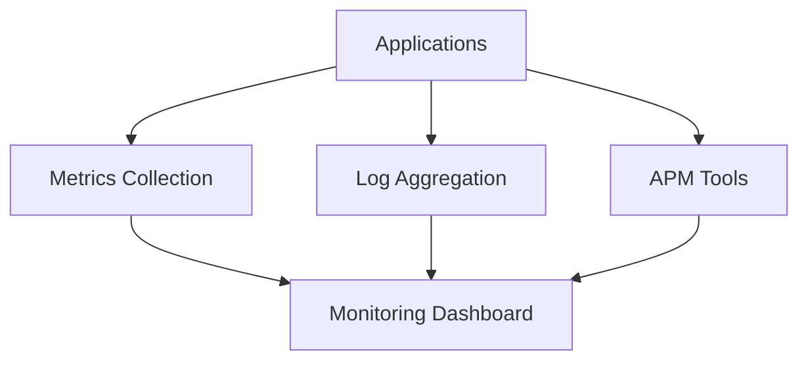

# MediNova System Architecture

## Overview

This document outlines the system architecture of the MediNova platform, including component diagrams, data flow, and infrastructure setup.

## System Components

## Data Flow

## Infrastructure Setup

## Security Architecture

## Backup and Recovery

## Deployment Architecture

## Performance Monitoring

## Capacity Planning

### Current Capacity
- Max concurrent users: 10,000
- Database IOPS: 20,000
- Storage: 5TB
- Network bandwidth: 1Gbps

### Scaling Thresholds
- CPU Usage > 70%
- Memory Usage > 80%
- Storage Usage > 75%
- Response Time > 200ms

### Growth Projections
1. Short-term (6 months)
   - Users: +50%
   - Storage: +2TB
   - IOPS: +30%

2. Long-term (2 years)
   - Users: +200%
   - Storage: +10TB
   - IOPS: +100%

### Auto-scaling Rules
- Scale out when CPU > 70% for 5 minutes
- Scale in when CPU < 30% for 15 minutes
- Minimum instances: 3
- Maximum instances: 20
